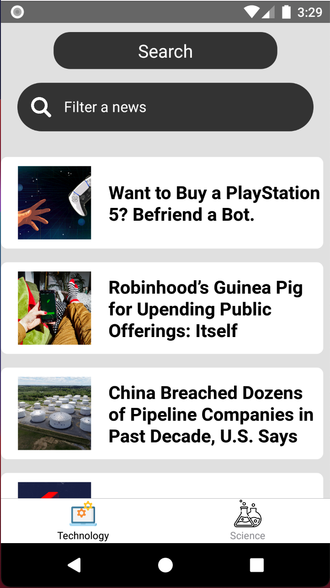
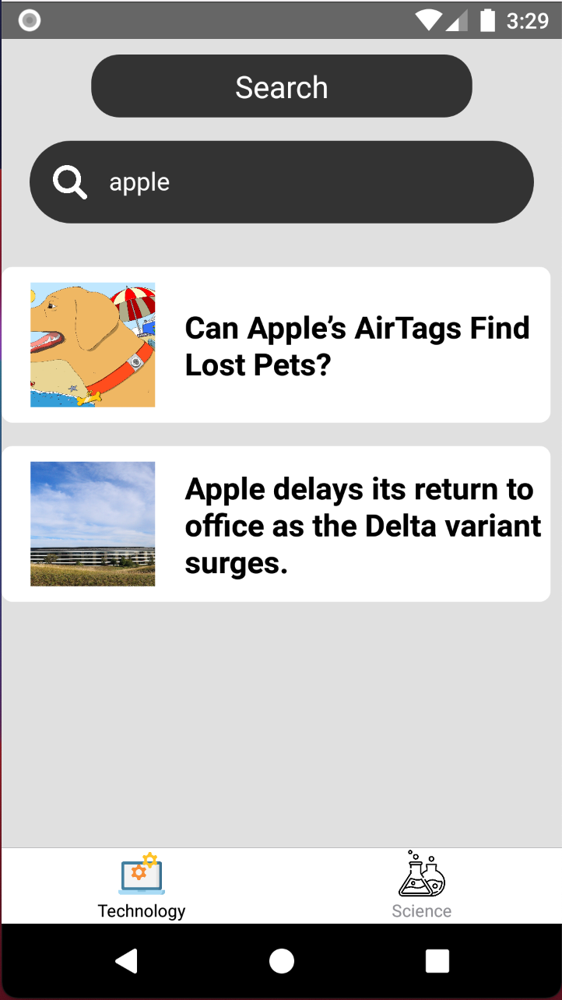

<h1 align="center">THE NEW YORK TIMES</h1>

<br>

<div align="center" >
  
  
  
</div>

<br><br>
### 💻 Projeto The New York Times

Este aplicativo é um portal de notícias utilizando React Native para a exibição de notícias de dois temas que estão dentro da api do [THE NEW YORK TIMES](https://developer.nytimes.com/).

<br>

Itens:
- [x] Consumo da API do NEW YORK TIMES
- [x] Duas abas com telas das categorias 'Technology' e 'Science'
- [x] Lista com as notícias
- [x] Campo de busca das notícias
- [x] Modal informativo com infos da notícia selecionada
- [x] Gráfico ilustrativo da cobertura de testes em /coverage/lcov-report/index.html

<br>

### 🧪 Tecnologias
- ✅ React Native
- ✅ React-Navigation (4x)
- ✅ Axios
- ✅ Flatlist
- ✅ StyleSheet
- ✅ TextInput
- ✅ Eslint
- ✅ Testes Unitários

<br>

** a imagem de loading não funciona em emuladores

<br>

## 🚀 Realizando download e Instalando o Projeto

Para realizar o clone e instalação do projeto, siga as etapas abaixo:

Clone o projeto e entre no diretório criado:

```
git clone https://github.com/luisgustavofin/The-New-York-Times-App
cd The-New-York-Times-App
```

Instale as dependências:
```
npm install
```

Inicie a aplicação no emulador:
```
react-native run-android
```
